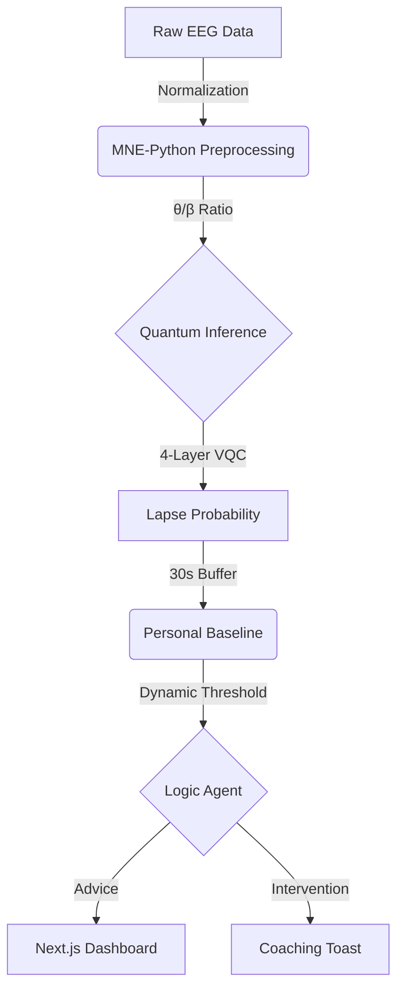

# QENCS: Quantum-Enhanced Neuro-Coaching System 🧠

> **The intersection of ADHD Support and Quantum Machine Learning.**

QENCS is a cutting-edge, clinical-grade neuro-coaching platform designed to detect and intervention in ADHD-related focus lapses using real-time EEG data and Variational Quantum Classifiers (VQC).

---

## 🚀 Executive Summary

QENCS bridges the gap between quantum-mechanical neural modeling and practical ADHD coaching. By utilizing a **4-layer Quantum Neural Network**, the system identifies subtle "Focus Signatures" in noisy brainwave data that standard AI often misses. It provides users with personalized, real-time coaching advice based on their own neural baseline.

---

## 📉 The Problem: The 'Noisy' ADHD Brain

Standard AI models (Classical ML) often fail to track ADHD focus states accurately because:
1.  **High Noise**: EEG data is naturally erratic, and ADHD brainwaves are even "noisier."
2.  **Linear Limitations**: Traditional algorithms look for flat patterns, but human focus is a complex, non-linear dance between several frequency bands (Theta, Alpha, Beta).
3.  **One-Size-Fits-All**: Most systems use fixed thresholds, ignoring the unique neural baseline of the individual.

---

## 🌌 The Solution: The Quantum Advantage

### 📻 The 'Radio Station' Analogy
Imagine Classical AI is like a radio tuned to one station at a time. It can hear the melody, but it misses the harmony. **QENCS Quantum ML** is like hearing the **whole symphony**. 

By mapping brainwaves into a high-dimensional **Hilbert Space**, our model doesn't just look at how loud one signal is; it uses **Quantum Entanglement** to see how all the wave bands "dance" together in real-time.

### 👥 The 'Crowded Room' Analogy
Imagine your brain is a crowded room with 100 people talking. Classical AI tries to listen to one person at a time (e.g., just the Beta waves). **QENCS uses Quantum Entanglement** to listen to the **rhythm of the whole room**. This allows us to detect exactly when you start to lose focus, even before you realize it yourself.

### ⚖️ Comparison: Classical vs. QENCS Quantum
| Feature | Classical AI (Old) | QENCS Quantum (New) |
| :--- | :--- | :--- |
| **Perspective** | Sees brainwaves as a flat 2D line. | Sees brainwaves in a massive 3D "Hilbert Space." |
| **Pattern Matching** | Looks for "High" or "Low" signals. | Uses **Entanglement** to see how all signals dance together. |
| **Speed/Precision** | Can get confused by "noisy" brain data. | Sifts through noise to find the "Focus Signature" instantly. |

---

## 🏗️ Architecture Walkthrough

### The Journey of a Brainwave


### The 4-Layer Quantum Circuit
Our model uses **9 Qubits** and **4 Strongly Entangling Layers**. 
- **Entanglement**: Links features together in the quantum state.
- **Non-Linearity**: Rotations (Angle Embedding) create complex decision boundaries mapping brain states to $[0, \pi]$.

---

## 📊 Visual Dashboard Guide

| Component | What it Represents | User Benefit |
| :--- | :--- | :--- |
| **Focus Gauge** | Your current "Flow State" (0-100%). | Instant feedback on mental engagement. |
| **EEG Monitor** | Real-time Theta, Alpha, and Beta waves. | Visualize your brain's spectral signature. |
| **Spectral Pie** | Real-time ratio of wave distribution. | See if your 'Task Engagement' (Beta) is dipping. |
| **Certainty Bar** | Quantum Model conviction score. | Know how "sure" the AI is about your state. |
| **Baseline Marker** | Your personalized neural reference point. | Compare current focus to your "normal" state. |

---

## 🛠️ Installation & Developer Guide

### Prerequisites
- Python 3.9+
- Node.js 18+
- PennyLane, PyTorch, FastAPI

### 1. Backend Setup
```bash
cd backend
pip install -r requirements.txt
python3 main.py
```

### 2. Frontend Setup
```bash
cd web-app
npm install
npm run dev
```

### 📡 Real Hardware Integration
To swap the 'Live Stream Simulator' for a real EEG device (Muse/OpenBCI):
1. Use **Lab Streaming Layer (LSL)** to broadcast your device's data.
2. Update the `LSL Inlet` in `backend/main.py` to listen for the stream.

---

## 🌟 Project Impact

QENCS isn't just a dashboard; it's a **Neuro-Feedback Lab**. 
- **Personalization**: Every user starts with a 30-second calibration.
- **Sensitivity**: Users can toggle coach intervention frequency (10%, 15%, 20%).
- **Clinical Relevance**: Tracks **Focus Entropy** and **Quantum Confidence**, providing deep insights for ADHD coaching.

---

*"Harnessing the power of the subatomic to support the power of the mind."*
